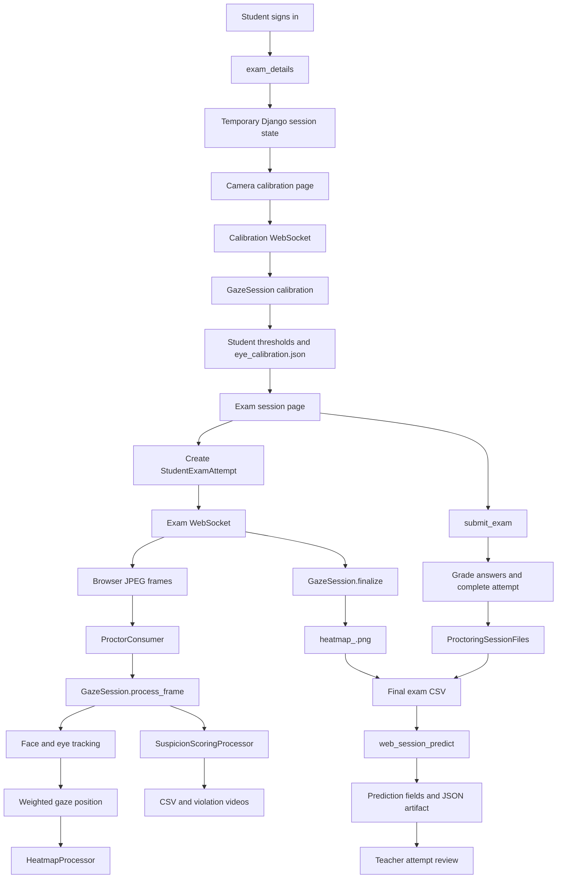

# MAKITEST System Architecture

MAKITEST has two execution modes. The Django web application is the integrated path; `main_trackerprocess.py` remains an optional standalone OpenCV tracker.



## Django Applications

### `homepage`

Provides landing, login, signup, and logout behavior. `CustomUser` supplies the user role and student class designation.

### `studentside`

Owns the student flow: exam listing, exam details, calibration handoff, exam rendering, answer saving, grading, submission, results, attempt records, calibration thresholds, registered session files, and prediction state.

### `camera`

Serves the calibration page and Channels consumer. `ProctorConsumer` creates one `GazeSession` per WebSocket connection and runs frame processing off the event loop.

### `teacherside`

Provides exam management, student management, attempt summaries, student attempt details, artifact viewing/downloading, and ZIP downloads.

## Web Session Pipeline

```text
JPEG frame
  -> FaceLandmarkerProcessor
  -> EyeLandmarkerProcessor
  -> FaceAxisProcessor
  -> EyeScreenPosProcessor
  -> GazeDirectionProcessor
  -> HeatmapProcessor
  -> SuspicionScoringProcessor
  -> frame_result JSON
```

Calibration runs before gaze scoring. After calibration, face-axis and eye-based positions are combined, valid positions are added to the heatmap, and suspicion data is returned to the browser.

The browser also reports suspicious key combinations, focus loss, and hidden tabs. The server does not use a global keyboard hook for browser sessions.

## Session and Database Ownership

```text
whatever/media/sessions/<session_id>/
    eye_calibration.json
    session_log_*.csv
    heatmap_<session_id>.png
    *_violation_*.mp4
    prediction/predicted_values.json
```

`StudentExamAttempt.proctoring_session_id` joins an attempt to `ProctoringSessionFiles.session_id`. Django session values are temporary navigation state; database fields and registered relative paths are the durable record.

The first CSV is the calibration log. The final registered CSV is the exam log. `get_exam_csv_path()` returns only that final log when a separate exam CSV exists.

## Prediction Contract

`web_session_predict.py` receives explicit paths from `ProctoringSessionFiles` and uses:

- The registered `heatmap_<session_id>.png` file.
- The final registered CSV as the exam log.
- `feature_columns.json` for model input order.
- `suspicion_model.joblib` for calibrated probabilities.

The calibration CSV is never passed to the web prediction service. Missing artifacts produce an unavailable or failed prediction state instead of a calibration-based prediction.

## Configuration

`whatever/whatever/settings.py` configures `TRACKER_DIR` so root tracking modules are importable, `SESSION_OUTPUT_DIR` as `whatever/media/sessions`, debug frame responses, and an in-memory Channels layer for development. A multi-process deployment needs a shared channel layer and a worker strategy for prediction.

## Standalone Mode

`main_trackerprocess.py` uses a local webcam, OpenCV windows, keyboard controls, and standalone output defaults. It is separate from the browser/Django workflow, which uses `GazeSession` through Django Channels.
