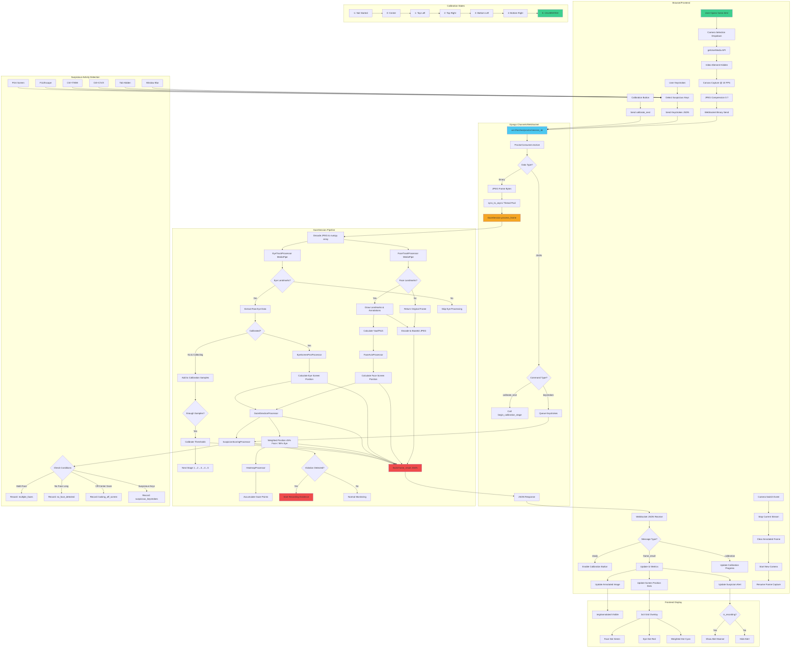

# MAKITEST System Architecture

This diagram shows the complete flow of the Django-based proctoring system, from camera capture in the browser to suspicious activity detection on the server.

## System Components

### 1. Frontend (Browser)
- **File**: `whatever/camera/templates/camera/home.html`
- **Purpose**: Capture webcam frames, handle camera switching, display annotated results
- **Key Features**:
  - Multi-camera selection with graceful switching
  - Canvas-based frame capture (640x480 @ 10 FPS)
  - Hidden video element for background processing
  - Real-time UI updates with screen position visualization
  - Suspicious keystroke detection

### 2. Django Channels WebSocket
- **File**: `whatever/camera/consumers.py`
- **Endpoint**: `/ws/proctor/{session_id}/`
- **Purpose**: Handle persistent WebSocket connections for real-time bidirectional communication
- **Protocol**:
  - Client → Server: Binary (JPEG frames), JSON (commands, keystrokes)
  - Server → Client: JSON (frame results, calibration status, alerts)

### 3. GazeSession Pipeline
- **File**: `gaze_session.py`
- **Purpose**: Core processing pipeline with MediaPipe models
- **Processors**:
  - `FaceTrackProcessor`: Detect face landmarks, draw annotations
  - `EyeTrackProcessor`: Detect iris positions for gaze tracking
  - `FaceAxisProcessor`: Convert head pose to screen coordinates
  - `EyeScreenPosProcessor`: Convert eye gaze to screen coordinates
  - `GazeDirectionProcessor`: Combine face and eye data (45%/55% weighting)
  - `HeatmapProcessor`: Track gaze patterns over time
  - `SuspicionScoringProcessor`: Detect violations and trigger recording

### 4. Calibration System
- **5-Stage Process**: Center → Top-Left → Top-Right → Bottom-Left → Bottom-Right
- **Purpose**: Personalize eye tracking for each student
- **Mechanism**: Collect eye samples at known screen positions, calculate thresholds

### 5. Suspicious Activity Detection
- **Browser-Side**: Keystroke detection (Ctrl+C/V/X/T/N/W, F11, Print Screen, Alt+Tab, window blur, tab hidden)
- **Server-Side**: Face detection, multi-face detection, off-screen gaze, prolonged absence

## Data Flow

1. **Camera Capture**: Browser captures frames from selected camera via getUserMedia
2. **Frame Transmission**: JPEG frames sent as binary WebSocket messages at 10 FPS
3. **Server Processing**: MediaPipe models analyze face/eye landmarks in thread pool
4. **Annotation**: Server draws tracking overlays and encodes as base64 JPEG
5. **Response**: JSON message with metrics, screen positions, and annotated frame
6. **Frontend Update**: Display annotated frame, update dots on 3x3 grid, show alerts

## Key Features

- ✅ Multi-camera support with live switching
- ✅ Device-agnostic (works with OBS virtual cameras, static images)
- ✅ Graceful frame filtering during camera transitions
- ✅ Always-on frame transmission (even without face detection)
- ✅ Session persistence across camera switches
- ✅ Real-time suspicious activity monitoring
- ✅ Evidence recording system for violations
